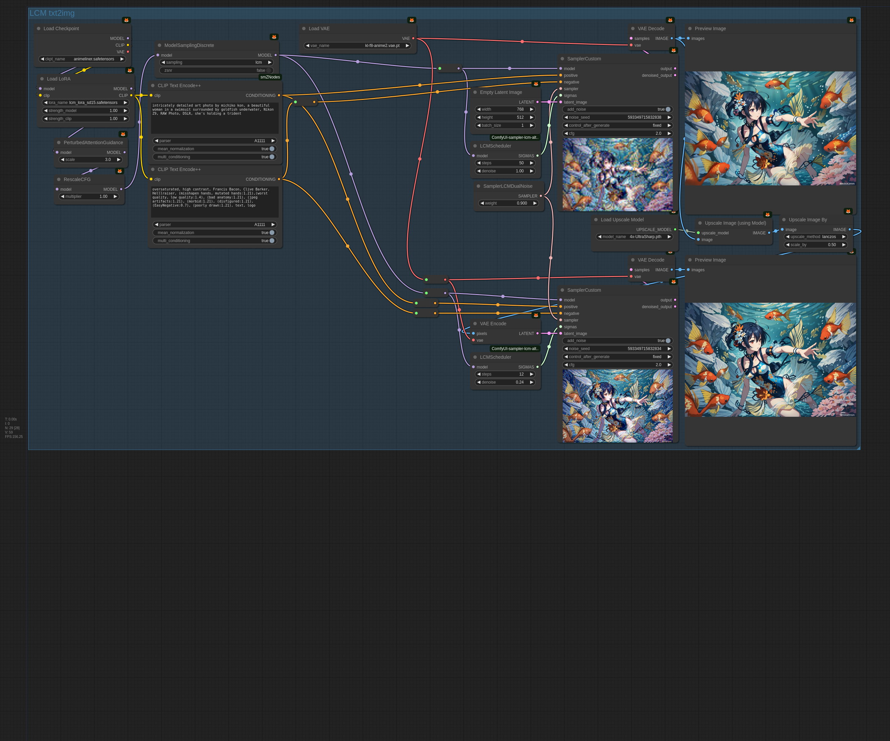

# ComfyUI-sampler-lcm-alternative
ComfyUI Custom Sampler nodes that add a new improved LCM sampler functions

This custom node repository adds three new nodes for ComfyUI to the Custom Sampler category. SamplerLCMAlternative, SamplerLCMCycle and LCMScheduler (just to save a few clicks, as you could also use the BasicScheduler and choose smg_uniform).
Just clone it into your custom_nodes folder and you can start using it as soon as you restart ComfyUI.

Update 2024.07.08: I've added a new node SamplerLCMDuoFusion. It's very similar to DualNoise, but easier to use because weight parameter only requires tuning when you change the model rather than every time you adjust the number of steps. Might also be slightly better in terms of quality on average, but that's hard to verify. 
Update 2024.06.29: I've added more parameters to SamplerLCMDualNoise. normalize_steps, reuse_lcm_noise and parallel.
Update 2024.06.24: I've added a new sampler SamplerLCMDualNoise. I consider the others obsolete now due to how stunnigly well this new sampler works. It achieves great results on SD1.5 (yes, the ORIGINAL!) plus LCM Lora with CFG 1.0 and only positive prompt.

SamplerLCMDuoFusion has two extra parameters.
- `weight`, if this is 0.0, the sampler acts like Euler. Anything more and it's running two denoisers at once and combining the results. Different models (and maybe styles?) require different amount of weight for optimal results. So far my theory is that for photorealism 1.0 seems close to optimal while for anime 0.6 could work better, or something in between.
- `reuse_noise`, whether to run the second denoiser with random noise for each step or whether to reuse the same noise every time. When true, the results tend to become a bit sharper and might end up requiring a reduction in weight for optimal results. Mainly good for img2img.

SamplerLCMDualNoise has four extra parameters.
- `weight`, With default settings, this sampler does Euler sampling with an additional LCM sampling step after each Euler step. The results are then combined with a weighted average function. This parameter controls how strongly the results bias towards the Euler sampler. 0.0 means both samplers are applied in full. 1.0 makes this sampler the same as Euler.
  I've experimentally found that weights between 0.66 and 0.95 seem to work best. The best weight depends on the number of steps and might also be affected by the prompt, CFG and other parameters. Consider these as rough starting points: 50 steps -> weight 0.95, 4 steps -> weight 0.66, 16 steps -> weight 0.8
- `normalize_steps`, this parameter runs the model `normalize_steps` times at the first sigma in the schedule and returns the original noise after each run. After that the normal sampling begins. The intention is to push the random distribution of the initial noise towards what the model tended to encounter during training. Hence, only do this for txt2img. img2img doesn't need it.
- `reuse_lcm_noise`, When this is false, the LCM step always uses fresh noise. When this is true, all LCM steps apply the same noise as the first step. Mainly useful with img2img when you want to add fine details to the scene.
- `parallel`, When false, euler and LCM samplings are done sequentially. LCM sampling processes the result of the Euler sampling after which the results are combined. When true, both samplers will process the result of the previous combined step.

SamplerLCMAlternative has two extra parameters.
- `euler_steps`, which tells the sampler to use Euler sampling for the first n steps (or skip euler only for last n steps if n is negative).
- `ancestral`, If you give this a value above 0.0, the Euler steps get some fresh randomness injected each step. The value controls how much.

With default parameters, this sampler acts exactly like the original LCM sampler from ComfyUI. When you start tuning, I recommend starting by setting `euler_steps` to half of the total step count this sampler will be handling. going higher will increase details/sharpness and lower will decrease both.

SamplerLCMCycle has three extra parameters. This sampler repeats a cycle of Euler and LCM sampling steps until inference is done.
If you're doing txt2img with LCM and feel like LCM is giving boring or artificial looking images, give this sampler a try.
- `euler_steps`, sets the number of euler steps per cycle
- `lcm_steps`, sets the number of lcm steps per cycle
- `ancestral`, same as with SamplerLCMAlternative

The default settings should work fine. I recommend using at least 6 steps to allow for 2 full cycles, that said, this sampler seems to really benefit from extra steps.

**I also higly recommend using the `RescaleCFG` node when using LCM Lora. With that, you can bump CFG up to 3.0 and sometimes even higher, which really helps quality and the effectiveness of negative prompt.**

Here's an example workflows for how to use SamplerLCMCycle and SamplerLCMDualNoise:

Here's also the example gen being shown in the SamplerLCMDualNoise workflow:

